# Multiplayer Vault and Mantle Movement Ability Documentation

[](https://youtu.be/6XIxt-OAEWA)

# How to Set It Up Using The Third Person Template

This tutorial shows how you can set up the Vault and Mantle ability using the Third Person Template and the `VaultOver` animation from the [Windwalker Echo](https://www.fab.com/listings/36a9d7fb-6769-4e45-a0b3-950890da82c1), both provided by Epic. 

It should be pretty straightforward to set it up on any project, just follow along and adjust according to your specific project details.

## 1. Create a C++ game project with the provided Third Person Template

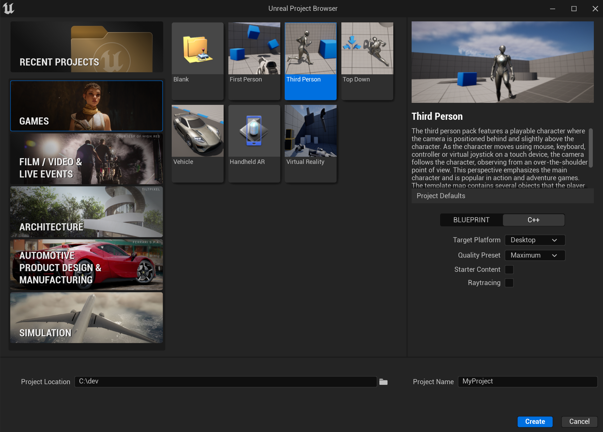

## 2. Enabling Required Plugins

Launch the editor and go to `Edit > Plugins` and enable the following plugins:

### `GameplayAbilities`

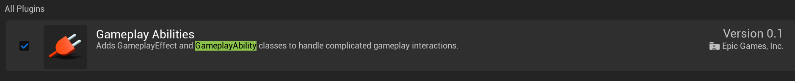

### `MotionWarping`


### `VaultMantle`

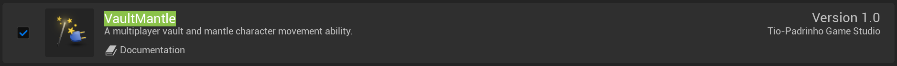

## 3. Adding the `MotionWarpingComponent` to the your `Character`

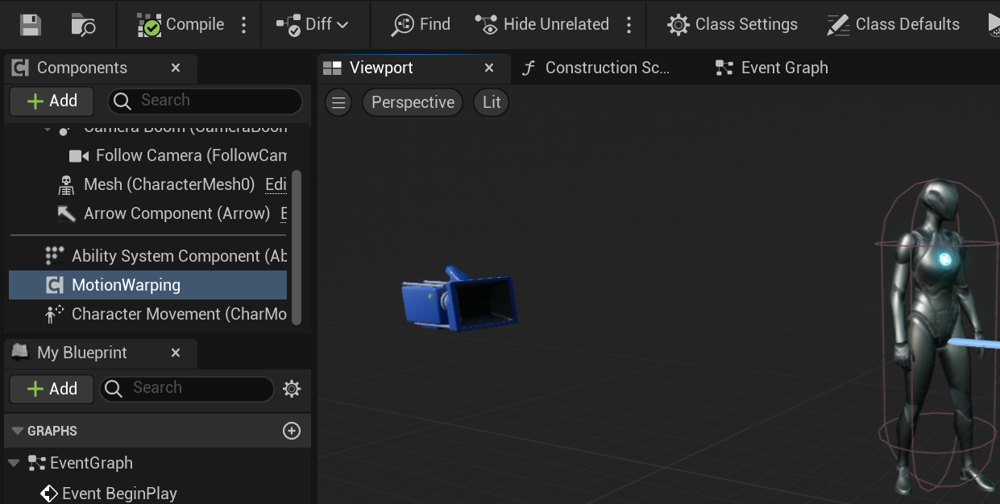

## 4. Setting up the Gameplay Ability System

For the sake of simplifying things a bit, let's setup the gameplay ability system (`AbilitySystemComponent`) in the `Character`. First, add the necessary dependencies to the project:

### Add the following dependencies to `YourProject.Build.cs`:
```csharp
PublicDependencyModuleNames.AddRange(
    new string[]
    {
        "Core",
        "CoreUObject",
        "Engine",
        "InputCore",
        "EnhancedInput",
        "GameplayAbilities",
        "GameplayTags",
        "GameplayTasks",
    }
);
```

### Add the `UAbilitySystemComponent` to the `YourCharacterClass.h`:

In your `YourCharacterClass.h` add `#include <AbilitySystemInterface.h>`
and forward declare the ability system component. Also add the interface to the character and the `GetAbilitySystemComponent` method declaration. You should have something like the following:

```cpp
#include "CoreMinimal.h"
#include "GameFramework/Character.h"
#include <AbilitySystemInterface.h>
#include "YourCharacterClass.generated.h"

class UAbilitySystemComponent;

UCLASS(config=Game)
class AYourCharacterClass : public ACharacter, public IAbilitySystemInterface
{
	GENERATED_BODY()

	UPROPERTY(VisibleAnywhere, BlueprintReadOnly, Category = GameplayAbility, meta = (AllowPrivateAccess = "true"))
	TObjectPtr<UAbilitySystemComponent> AbilitySystemComponent;

    // other stuff
}
```
  
### In your `AYourCharacterClass.cpp` file include the `AbilitySystemComponent.h` header, add the `GetAbilitySystemComponent` method implementation, and also setup the `AbilitySystemComponent` like so:
```cpp
#include <AbilitySystemComponent.h>
// other includes

AYourCharacterClass::AYourCharacterClass()
{
	AbilitySystemComponent = CreateDefaultSubobject<UAbilitySystemComponent>(TEXT("AbilitySystemComponent"));
	AbilitySystemComponent->SetIsReplicated(true);
	AbilitySystemComponent->SetReplicationMode(EGameplayEffectReplicationMode::Mixed);
}

UAbilitySystemComponent* AYourCharacterClass::GetAbilitySystemComponent() const
{
	return AbilitySystemComponent;
}
```

### Granting the Ability: On Character's `BeginPlay`:

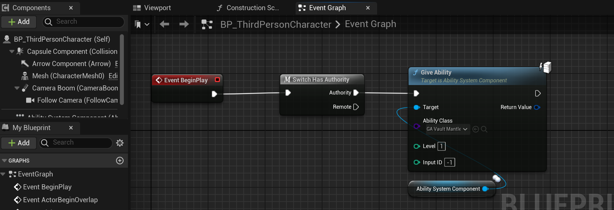

### If needed open the `GA_VaultMantle` ability and setup its parameters such as montages to play, size of trace box, and so on:

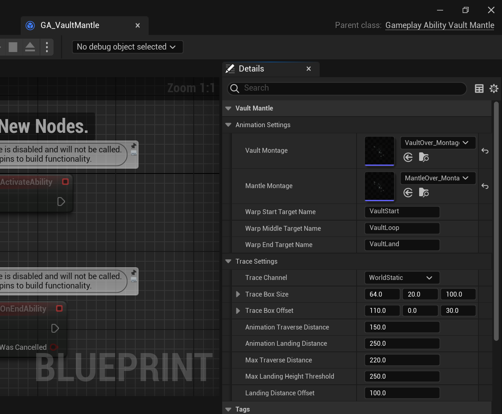

## 5. Setting up Inputs and Triggering the Ability

### Inputs

Create a new InputAction so we can trigger the ability by pressing a key:

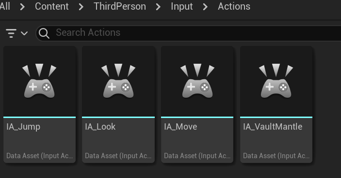

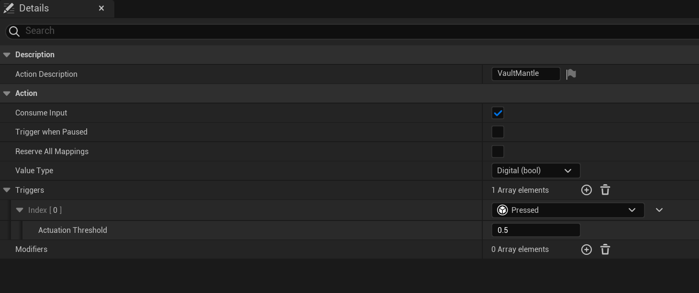

Add it to your InputMappingContext like so:

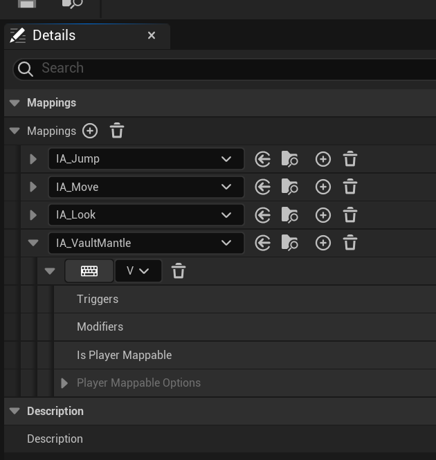

### Triggering the Ability:

For this example we're going to activate the ability by using its gameplay tag as follows:

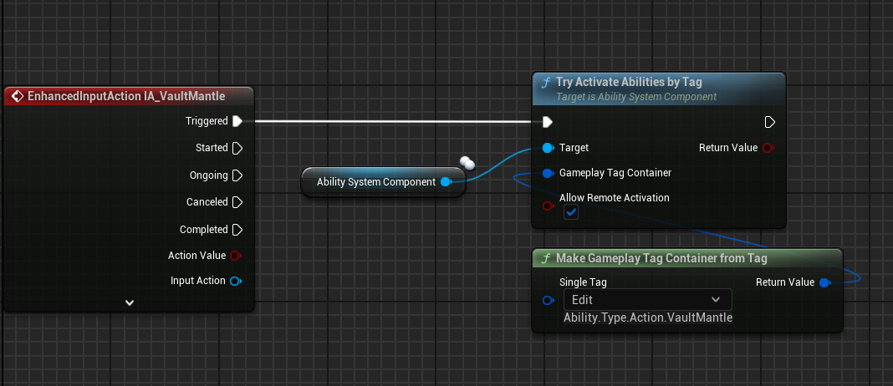

---
# FAQ

## 1. My project doesn't use the Gameplay Ability System (GAS), will it work?

Unfortunately no. There is another plugin coming soon that will enable projects without GAS to have this gameplay mechanic. Stay tuned.

## 2. Compatible with Lyra?

Yes, but if you want to use it with the Lyra Ability Set (`ULyraAbilitySet`) it requires you to create a new C++ ability based on the `ULyraGameplayAbility`.
You can simple copy and paste the relevant code from the `UGameplayAbility_VaultMantle` and that's it. 
If using the `Windwalker Echo` animation make sure to retarget to Lyra's character skeleton. 
When opening the montage you should get something similar to the following screens:


Pick a replacement for the skeleton:

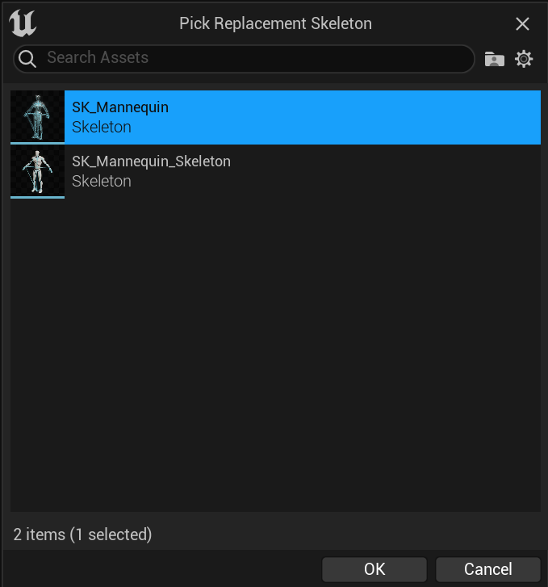

### Lyra video example:

[](https://youtu.be/tnI1joUvRi4)
